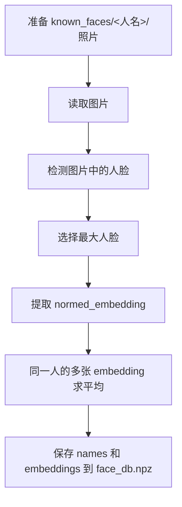
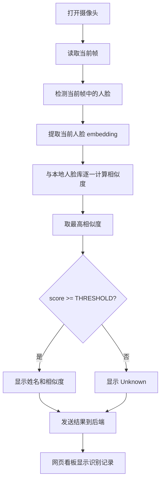

# 人工智能基础课程期末项目说明与答辩材料

项目名称：基于 InsightFace 的本地实时人脸识别系统

项目类型：人工智能基础课程期末项目

项目目标：使用预训练深度学习模型完成人脸检测、人脸特征提取、身份匹配、实时摄像头识别和本地识别记录管理。

## 1. 项目简介

本项目实现了一个可以在本地电脑运行的人脸识别系统。用户先把已知人员照片放入 `known_faces/` 目录，程序通过 InsightFace 模型提取每个人的人脸特征向量，并保存为本地人脸库 `face_db.npz`。运行识别时，系统打开摄像头，实时检测画面中的人脸，提取当前人脸特征，再与本地人脸库逐一计算相似度，最终判断该人是已注册人员还是 Unknown。

系统还包含一个 FastAPI 后端和网页看板，可以记录识别结果、管理人员照片，并通过网页查看最近识别记录。

一句话概括：

> 本项目用深度学习模型把人脸图像转换为特征向量，再用向量相似度完成身份识别。

## 2. 项目功能

| 功能 | 说明 |
| --- | --- |
| 人脸注册 | 从 `known_faces/<人名>/` 中读取照片，提取每个人的人脸特征 |
| 人脸检测 | 在摄像头画面中定位人脸位置 |
| 人脸识别 | 将当前人脸与本地人脸库进行相似度匹配 |
| Unknown 判断 | 相似度低于阈值时显示 Unknown |
| 实时可视化 | 在摄像头画面中绘制人脸框、姓名、相似度、FPS |
| 中文显示 | 使用 Pillow 绘制中文姓名，解决 OpenCV 中文乱码问题 |
| 后端记录 | 将识别结果写入 FastAPI + SQLite 后端 |
| 网页管理 | 在本地网页中查看记录、管理人员和照片、重新注册人脸库 |

## 3. 用到的人工智能知识

### 3.1 计算机视觉

本项目属于计算机视觉方向。输入数据不是表格或文本，而是摄像头画面和人脸照片。系统需要从图像中理解“哪里有人脸”和“这张脸属于谁”。

项目中对应的计算机视觉任务包括：

| 任务 | 项目中的体现 |
| --- | --- |
| 图像读取 | 使用 OpenCV 读取图片和摄像头帧 |
| 目标检测 | 从画面中检测人脸位置 |
| 图像特征提取 | 将人脸图片转换为特征向量 |
| 可视化标注 | 在画面上绘制检测框和识别结果 |

### 3.2 深度学习与卷积神经网络

项目没有从零训练模型，而是使用 InsightFace 提供的预训练模型 `buffalo_sc`。该模型内部基于深度神经网络，能够从大量人脸数据中学习人脸的结构特征。

在课程知识中的对应关系：

| 课程知识点 | 项目体现 |
| --- | --- |
| 神经网络 | 使用预训练人脸识别网络进行推理 |
| 深度学习 | 模型自动从图像中提取高层语义特征 |
| 卷积神经网络 | 人脸检测和识别模型通常使用 CNN 结构处理图像 |
| 预训练模型 | 使用已有模型能力，不需要自己从零收集大量数据训练 |
| 模型推理 | 输入图片，模型输出人脸框和特征向量 |

答辩时可以这样说：

> 我们没有自己训练一个人脸识别模型，而是使用经过大规模数据训练的 InsightFace 预训练模型。课程中讲到的深度学习模型训练成本较高，因此本项目采用迁移学习和预训练模型思路，把重点放在模型应用、特征匹配和完整系统实现上。

### 3.3 人脸检测

人脸检测解决的问题是：在一张图片或一帧摄像头画面中，找出人脸的位置。

项目中调用：

```python
faces = app.get(frame)
```

模型会返回每张人脸的边界框 `bbox`。程序根据边界框在画面上绘制矩形：

```python
cv2.rectangle(frame, (box[0], box[1]), (box[2], box[3]), color, 2)
```

这一部分对应人工智能中的目标检测任务。

### 3.4 特征表示与 embedding

人脸识别并不是直接比较两张图片的像素，而是先把人脸转换为一个固定长度的数字向量。这个向量叫做 embedding，也叫特征向量。

项目中使用：

```python
emb = face.normed_embedding
```

embedding 的作用：

| 作用 | 说明 |
| --- | --- |
| 降维表达 | 用一组数字概括一张人脸的身份特征 |
| 去除无关信息 | 尽量减少光照、背景、角度对识别的影响 |
| 方便计算 | 向量之间可以用数学方法快速比较 |
| 支持存储 | 本地人脸库只保存特征向量，不必每次读取原图 |

答辩时可以这样解释：

> embedding 可以理解为模型给每张人脸生成的“数字身份证”。同一个人的不同照片，embedding 通常比较接近；不同人的 embedding 通常距离较远。

### 3.5 向量归一化与余弦相似度

项目使用的是 `normed_embedding`，也就是已经归一化过的人脸向量。归一化后，向量长度接近 1，因此两个向量的点积可以近似看作余弦相似度。

项目中的相似度计算：

```python
sims = embeddings @ emb
```

含义：

```text
当前人脸 embedding
    和 张三 embedding 比较 -> 相似度 0.25
    和 李四 embedding 比较 -> 相似度 0.72
    和 王五 embedding 比较 -> 相似度 0.18
```

相似度最高的人就是最可能的身份。

这部分对应课程中的知识：

| 知识点 | 项目体现 |
| --- | --- |
| 向量空间 | 每个人脸被表示为高维向量 |
| 归一化 | 使用 `normed_embedding` 降低向量长度差异影响 |
| 距离度量 | 用余弦相似度判断两张人脸是否接近 |
| 最近邻思想 | 在已注册人脸库中寻找最相似的人员 |

### 3.6 阈值分类

仅仅找到相似度最高的人还不够，还需要判断“像不像到足以认为是同一个人”。项目中设置了阈值：

```python
THRESHOLD = 0.4
```

判断逻辑：

```python
if score >= THRESHOLD:
    status = "recognized"
else:
    status = "unknown"
```

这相当于一个简单的二分类决策：

| 条件 | 结果 |
| --- | --- |
| 最高相似度 >= 阈值 | 识别为某个已注册人员 |
| 最高相似度 < 阈值 | 判断为 Unknown |

阈值的影响：

| 阈值变化 | 效果 |
| --- | --- |
| 阈值调高 | 更严格，误识别减少，但可能把熟人识别成 Unknown |
| 阈值调低 | 更宽松，漏识别减少，但可能增加误识别 |

这体现了人工智能系统中常见的精确率与召回率权衡。

### 3.7 数据集与样本质量

本项目的人脸库相当于一个小型本地数据集。每个人一个文件夹，每张照片都是该人员的注册样本。

样本质量会影响识别效果：

| 样本情况 | 影响 |
| --- | --- |
| 照片清晰、正脸 | 特征更稳定，识别更准确 |
| 光线过暗、遮挡严重 | embedding 可能不稳定 |
| 每人多张不同角度照片 | 平均特征更有代表性 |
| 一张图中多个人脸 | 程序只取最大脸，可能注册错误 |

项目中对同一个人的多张照片求平均 embedding，相当于用多个样本综合描述一个人：

```text
张三照片 1 -> embedding 1
张三照片 2 -> embedding 2
张三照片 3 -> embedding 3
平均后得到 张三 的代表性 embedding
```

### 3.8 模型部署与 AI 应用工程

人工智能项目不仅要有模型，还要能运行、能交互、能展示。本项目把 AI 推理能力封装成一个可使用的本地系统。

工程实现包括：

| 模块 | 技术 |
| --- | --- |
| 模型推理 | InsightFace + ONNXRuntime |
| 图像处理 | OpenCV |
| 中文渲染 | Pillow |
| 后端接口 | FastAPI |
| 数据存储 | SQLite |
| 前端网页 | HTML + CSS + JavaScript |
| 一键运行 | Windows `.bat` 脚本 |

这体现了 AI 应用落地的完整链路：


### 3.9 隐私与伦理

人脸数据属于敏感生物特征数据。本项目体现了人工智能应用中的隐私保护意识：

| 隐私设计 | 说明 |
| --- | --- |
| 本地运行 | 摄像头画面和照片默认不上传云端 |
| 本地人脸库 | `face_db.npz` 保存在本机 |
| 敏感数据提醒 | `known_faces/`、`face_db.npz`、识别日志都不应公开 |
| 最小化存储 | 识别阶段主要使用 embedding，不需要反复读取原图 |

答辩时可以补充：

> 人脸识别技术具有便利性，但也涉及隐私和授权问题。实际应用中必须取得被识别人员同意，并保护人脸照片、特征库和识别记录。

## 4. 系统整体流程

### 4.1 注册流程



### 4.2 识别流程



## 5. 项目亮点

1. 使用预训练深度学习模型，避免从零训练模型带来的数据和算力压力。
2. 将人脸识别问题转化为 embedding 向量相似度匹配，逻辑清晰，便于解释。
3. 支持本地实时摄像头识别，能在课堂上现场演示。
4. 具备完整的注册、识别、记录、网页展示流程，不只是单个算法 demo。
5. 使用 SQLite 本地保存识别记录，方便展示系统运行结果。
6. 处理了 Windows 中文路径和中文姓名显示问题，更适合中文课程环境。
7. 注意人脸隐私保护，识别过程默认本地运行。

## 6. 项目难点与解决方案

| 难点 | 解决方案 |
| --- | --- |
| 摄像头实时识别速度有限 | 使用 `buffalo_sc` 小模型，只启用 detection 和 recognition，检测尺寸设为 `(320, 320)` |
| 中文姓名在 OpenCV 中显示乱码 | 使用 Pillow 绘制中文文字 |
| 不同光照和角度影响识别 | 每个人可注册多张照片，并求平均 embedding |
| 误识别和漏识别需要平衡 | 设置相似度阈值 `THRESHOLD = 0.4`，可按场景调整 |
| 部署到其他电脑容易缺依赖 | 提供 `setup.bat`、`run_backend.bat`、`run_camera.bat` 等脚本 |
| 识别结果难以展示 | 增加 FastAPI 后端和网页看板 |

## 7. 与人工智能基础课程知识的对应关系

| 课程知识点 | 本项目对应内容 |
| --- | --- |
| 人工智能应用场景 | 人脸识别、身份认证、智能考勤 |
| 机器学习基本流程 | 数据准备、特征提取、模型推理、结果判断 |
| 深度学习 | 使用 InsightFace 深度人脸识别模型 |
| 计算机视觉 | 处理图片和摄像头画面 |
| 目标检测 | 检测画面中的人脸位置 |
| 特征工程/表示学习 | 使用 embedding 表示人脸身份特征 |
| 相似度计算 | 使用余弦相似度匹配人脸 |
| 分类决策 | 使用阈值判断 recognized / unknown |
| 模型评估思想 | 关注误识别、漏识别、阈值调整、样本质量 |
| AI 伦理 | 关注人脸数据隐私、授权和本地存储 |
| AI 工程化 | 将模型集成到摄像头、后端、网页和脚本中 |

## 8. 答辩 PPT 建议结构

### 第 1 页：标题页

标题：基于 InsightFace 的本地实时人脸识别系统

内容：

- 课程：人工智能基础
- 项目成员：填写姓名
- 指导教师：填写教师姓名
- 日期：填写答辩日期

讲解重点：

> 我们的期末项目是一个本地运行的人脸识别系统，能够完成人脸注册、摄像头实时识别和网页端识别记录展示。

### 第 2 页：项目背景与意义

可放内容：

- 人脸识别是人工智能在计算机视觉方向的典型应用。
- 可用于门禁、考勤、身份核验等场景。
- 本项目关注“AI 模型如何从算法变成可演示系统”。

讲解重点：

> 人脸识别不是简单比较照片，而是通过深度学习模型理解人脸特征，再进行相似度判断。

### 第 3 页：系统功能

可放内容：

- 人脸照片注册
- 实时摄像头识别
- Unknown 判断
- 识别结果记录
- 本地网页管理

建议配图：

- 放一张网页看板截图
- 放一张摄像头识别截图

### 第 4 页：系统架构

可放流程：

```text
known_faces 照片
    -> InsightFace 提取 embedding
    -> face_db.npz 人脸库
    -> 摄像头实时画面
    -> 检测人脸并提取 embedding
    -> 相似度匹配
    -> 显示结果并写入后端
```

讲解重点：

> 系统分为注册阶段和识别阶段。注册阶段建立人脸库，识别阶段实时匹配当前人脸。

### 第 5 页：核心 AI 原理

可放内容：

- 人脸检测：找出图像中的人脸位置。
- embedding：把人脸转换为高维特征向量。
- 余弦相似度：比较两个向量是否接近。
- 阈值判断：决定是否识别为已知人员。

讲解重点：

> 本项目核心是“深度学习特征提取 + 向量相似度匹配”。

### 第 6 页：关键算法流程

可放内容：

```text
当前人脸 -> embedding
embedding 与人脸库逐一比较
取最大相似度 score
score >= 0.4 -> 显示姓名
score < 0.4  -> 显示 Unknown
```

讲解重点：

> 阈值越高，系统越严格；阈值越低，系统越宽松。这体现了人工智能分类决策中的权衡。

### 第 7 页：工程实现

可放内容：

| 模块 | 技术 |
| --- | --- |
| AI 模型 | InsightFace |
| 图像处理 | OpenCV |
| 中文显示 | Pillow |
| 后端服务 | FastAPI |
| 数据库 | SQLite |
| 前端页面 | HTML/CSS/JavaScript |

讲解重点：

> 项目不仅调用模型，还实现了注册、识别、存储、展示和一键运行脚本。

### 第 8 页：项目演示

演示顺序：

1. 打开后端网页：`scripts/run_backend.bat`
2. 展示人员管理和识别记录页面。
3. 运行摄像头识别：`scripts/run_camera.bat`
4. 让已注册人员进入画面，观察绿色识别框。
5. 让未注册人员进入画面，观察 Unknown。
6. 回到网页查看识别记录变化。

讲解重点：

> 这一页重点展示系统可以真实运行，而不是只停留在算法代码。

### 第 9 页：项目总结

可放内容：

- 掌握了计算机视觉和人脸识别的基本流程。
- 理解了 embedding、相似度和阈值判断。
- 完成了从 AI 模型到本地应用系统的集成。
- 认识到人脸识别中的隐私与伦理问题。

### 第 10 页：不足与改进

可放内容：

| 当前不足 | 后续改进 |
| --- | --- |
| CPU 实时性能有限 | 后续可接入 GPU 推理 |
| 样本较少会影响准确率 | 增加不同角度和光照的注册照片 |
| 阈值固定 | 可根据验证集自动选择阈值 |
| 仅支持本地单机 | 后续可扩展多摄像头或局域网部署 |
| 未做活体检测 | 后续可加入防照片攻击能力 |

## 9. 答辩讲稿示例

### 1 分钟简短版

老师好，我们的期末项目是基于 InsightFace 的本地实时人脸识别系统。它主要实现了人脸注册、摄像头实时识别、Unknown 判断和网页端识别记录展示。

项目用到了人工智能基础课程中的计算机视觉、深度学习、特征表示、相似度计算和阈值分类等知识。系统先用预训练模型检测人脸，并把人脸转换成 embedding 特征向量。注册时，每个人的特征会保存到本地人脸库；识别时，程序会把当前摄像头画面中的人脸特征与人脸库逐一计算余弦相似度，最高相似度超过阈值就识别为对应人员，否则显示 Unknown。

除了 AI 模型部分，我们还实现了 FastAPI 后端、SQLite 识别记录和本地网页看板，使项目可以完整演示。通过这个项目，我们理解了人脸识别从图像输入、模型推理、特征匹配到系统展示的完整流程，也注意到了人脸数据的隐私保护问题。

### 3 分钟详细版

老师好，我们的项目名称是“基于 InsightFace 的本地实时人脸识别系统”。项目目标是实现一个可以在普通 Windows 电脑上运行的人脸识别应用，支持人员注册、摄像头实时识别、识别记录保存和网页查看。

从人工智能知识角度看，本项目首先属于计算机视觉应用。系统输入的是图片和摄像头画面，程序需要判断画面中是否有人脸，以及该人脸属于谁。我们使用 InsightFace 的预训练模型完成深度学习推理。模型内部已经学习了大量人脸数据的特征，因此我们不需要从零训练模型，而是把重点放在模型应用和系统集成上。

核心流程分为注册和识别两个阶段。注册阶段，用户把照片放到 `known_faces` 目录下，每个人一个文件夹。程序读取照片，检测其中的人脸，然后提取 `normed_embedding`。如果一个人有多张照片，程序会对多个 embedding 求平均，得到这个人的代表性特征，并保存到 `face_db.npz`。

识别阶段，程序打开摄像头，实时读取画面。模型会检测当前帧中的人脸并提取 embedding。之后系统将当前 embedding 与人脸库中所有人员的 embedding 计算余弦相似度，也就是代码中的矩阵乘法 `embeddings @ emb`。如果最高相似度大于等于阈值 0.4，就显示对应姓名；否则显示 Unknown。

工程实现方面，我们使用 OpenCV 处理摄像头和画面绘制，使用 Pillow 解决中文姓名显示问题，使用 FastAPI 和 SQLite 保存识别记录，并制作了一个本地网页看板用于展示和管理。为了方便部署，我们还提供了 Windows 批处理脚本，可以一键安装依赖、启动后端和运行摄像头识别。

这个项目让我理解了人工智能系统并不只是模型本身，还包括数据准备、模型推理、结果判断、界面展示、部署运行和隐私保护等完整环节。

## 10. 答辩常见问题与参考回答

### Q1：你们这个项目用到了哪些人工智能知识？

参考回答：

> 主要用到了计算机视觉、深度学习、人脸检测、特征向量 embedding、向量归一化、余弦相似度、阈值分类和 AI 工程化部署。项目通过预训练模型提取人脸特征，再用相似度匹配完成身份识别。

### Q2：为什么不直接比较两张图片的像素？

参考回答：

> 因为同一个人在不同光照、角度、表情下，像素差异可能很大；不同人如果背景相似，像素也可能接近。直接比较像素不可靠。深度学习模型提取的 embedding 更关注身份相关特征，因此更适合人脸识别。

### Q3：embedding 是什么？

参考回答：

> embedding 是模型把人脸转换成的一组数字向量，可以理解为人脸的特征编码。同一个人的不同照片，embedding 通常比较接近；不同人的 embedding 通常差异较大。

### Q4：系统如何判断是不是同一个人？

参考回答：

> 系统把当前人脸 embedding 与已注册人员的 embedding 计算余弦相似度，选择相似度最高的人。如果最高相似度大于等于阈值 0.4，就识别为该人员；否则判断为 Unknown。

### Q5：阈值为什么设置为 0.4？

参考回答：

> 0.4 是一个经验阈值，在当前模型和样本下可以作为初始值。阈值越高，识别越严格，误识别会减少，但可能增加 Unknown；阈值越低，识别更宽松，但可能增加误识别。实际应用中应该用更多测试样本来调节阈值。

### Q6：如果一个人有多张注册照片，系统怎么处理？

参考回答：

> 系统会分别提取每张照片的人脸 embedding，然后对这些 embedding 求平均，再归一化，得到这个人的代表性特征。这样可以降低单张照片角度或光照带来的影响。

### Q7：这个项目有没有训练模型？

参考回答：

> 本项目没有从零训练模型，而是使用 InsightFace 的预训练模型进行推理。这样更符合课程期末项目的实际条件，因为从零训练人脸识别模型需要大量数据和算力。我们的重点是理解和应用模型，把模型集成到完整系统中。

### Q8：使用预训练模型是不是就不算人工智能项目？

参考回答：

> 仍然算。人工智能项目不一定都要从零训练模型。很多实际 AI 应用也是使用预训练模型，再结合具体场景做数据处理、特征匹配、阈值决策和系统部署。本项目完整体现了模型推理和 AI 应用落地流程。

### Q9：系统如何保护隐私？

参考回答：

> 项目默认本地运行，摄像头画面、人脸照片和识别日志都保存在本机，不上传云端。同时文档中也提醒 `known_faces`、`face_db.npz`、`recognition.db` 都属于敏感数据，不应该公开提交或随意传播。

### Q10：项目还有什么不足？

参考回答：

> 当前主要不足是 CPU 推理速度有限、样本较少时准确率会受影响、阈值还是手动设置，并且没有加入活体检测。后续可以接入 GPU、增加测试集自动选择阈值、加入活体检测和多摄像头支持。

## 11. 现场演示脚本

### 演示前准备

1. 确认 Python 依赖已经安装。
2. 确认 `face_db.npz` 已经生成。
3. 确认摄像头可用。
4. 准备至少一个已注册人员和一个未注册人员。
5. 不要展示包含敏感照片的文件夹细节，避免隐私泄露。

### 演示步骤

```powershell
cd E:\XMUT\3down\人工智能\faceRecognition\mine
```

启动后端：

```powershell
scripts\run_backend.bat
```

打开网页：

```text
http://127.0.0.1:8000/
```

启动摄像头识别：

```powershell
scripts\run_camera.bat
```

演示话术：

> 现在我们打开摄像头，系统会实时检测画面中的人脸。绿色框表示识别成功，红色框表示 Unknown。识别结果会发送到本地后端，并在网页中形成记录。

### 备用命令

如果不用 `.bat`，可以使用命令行：

```powershell
python -m uvicorn backend.main:app --reload --host 127.0.0.1 --port 8000
python face_recog.py run --cam 0 --api http://127.0.0.1:8000/api/recognitions
```

如果摄像头 0 打不开：

```powershell
python face_recog.py run --cam 1 --api http://127.0.0.1:8000/api/recognitions
```

## 12. 可以放进报告的项目总结

本项目完成了一个基于深度学习的人脸识别应用系统。系统使用 InsightFace 预训练模型完成人脸检测和人脸 embedding 提取，通过余弦相似度和阈值判断实现身份识别，并结合 OpenCV、FastAPI、SQLite 和前端网页完成了从模型推理到结果展示的完整流程。

通过本项目，我们理解了人工智能基础课程中的多个核心概念，包括计算机视觉、深度学习、特征表示、相似度度量、分类决策、模型部署和 AI 伦理。项目也让我们认识到，一个可用的人工智能系统不仅需要算法模型，还需要数据管理、工程实现、交互界面和隐私保护等多方面配合。

## 13. 关键代码位置

| 内容 | 文件 |
| --- | --- |
| 人脸注册 | `face_recog.py` 的 `register(folder)` |
| 摄像头识别 | `face_recog.py` 的 `run(cam_id, save_video, api_url, api_interval)` |
| 模型加载 | `face_recog.py` 的 `get_app()` |
| 相似度计算 | `face_recog.py` 中的 `sims = embeddings @ emb` |
| 阈值判断 | `face_recog.py` 中的 `if score >= THRESHOLD` |
| 中文渲染 | `face_recog.py` 中的 `_put_text()` |
| 后端 API | `backend/main.py` |
| 前端页面 | `backend/static/index.html`、`backend/static/style.css`、`backend/static/app.js` |

