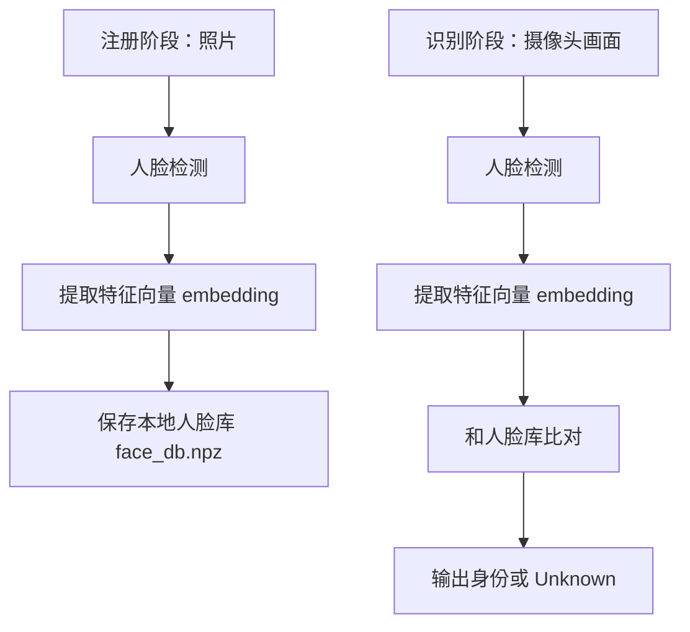
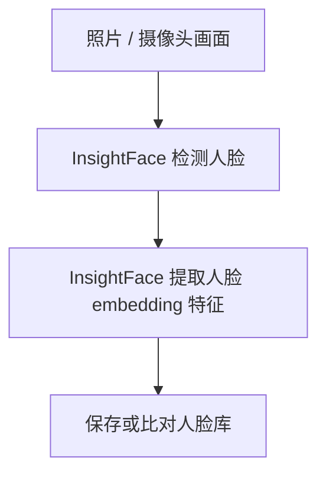
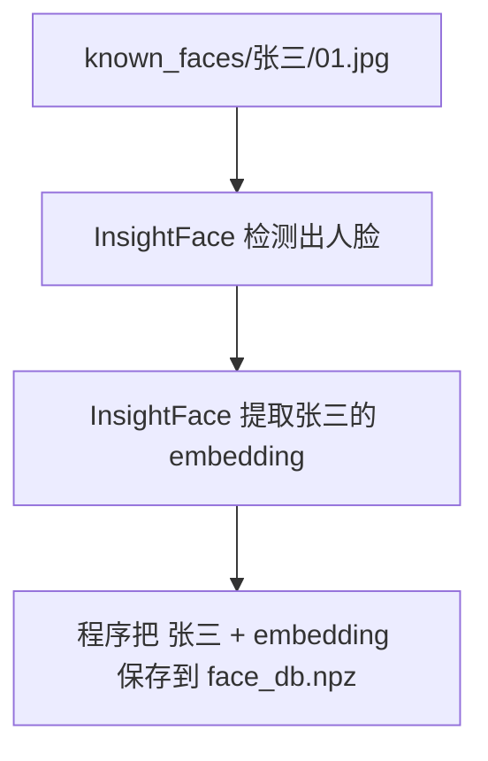
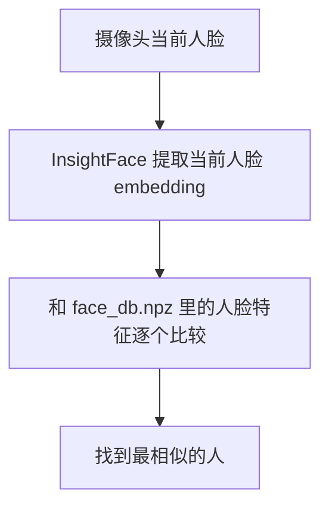
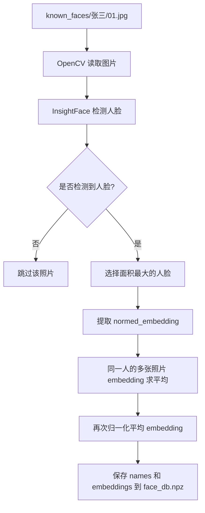
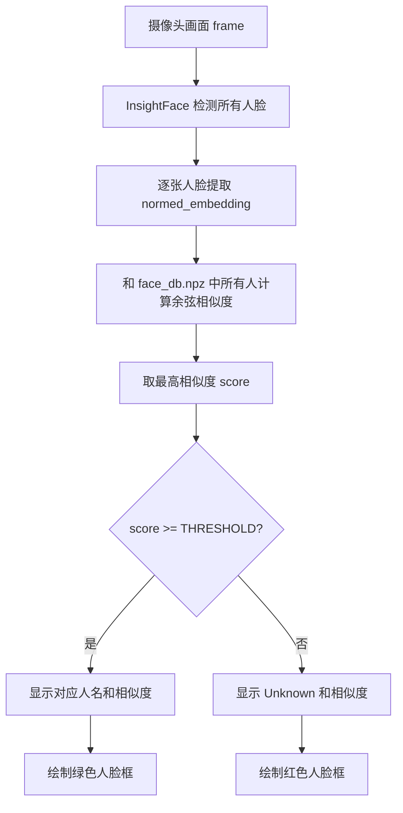

# 人脸识别身份识别技术实现说明

本文档解释本项目 `face_recog.py` 中“人脸识别 / 身份识别”功能是如何实现的。

项目基于 InsightFace，本地离线运行，不把图片、人脸特征或识别结果上传到云端。核心流程可以概括为：



---

## 1. 使用的核心技术

本项目使用 `insightface.app.FaceAnalysis` 加载 InsightFace 的 `buffalo_sc` 模型包：

```python
APP = FaceAnalysis(
    name="buffalo_sc",
    root=ROOT,
    providers=["CPUExecutionProvider"],
    allowed_modules=["detection", "recognition"],
)
APP.prepare(ctx_id=0, det_size=(320, 320))
```

关键配置含义：

| 配置 | 作用 |
| --- | --- |
| `buffalo_sc` | InsightFace 的轻量模型包，适合 CPU 运行 |
| `CPUExecutionProvider` | 使用 CPU 推理，不依赖显卡 |
| `allowed_modules=["detection", "recognition"]` | 只启用人脸检测和人脸识别模块，减少计算量 |
| `det_size=(320, 320)` | 检测输入尺寸较小，速度更快 |

本项目主要使用两个能力：

| 能力 | 说明 |
| --- | --- |
| 人脸检测 | 在图片或摄像头画面中找出人脸位置，即人脸框 `bbox` |
| 人脸识别 | 把每张人脸转换成一个固定长度的特征向量 `embedding` |

---

## 2. InsightFace 与人脸库的关系

`InsightFace` 和“人脸库”的关系可以理解为：

```text
InsightFace 是特征提取工具
人脸库是特征保存结果
```

在本项目中，它们的关系如下：



### 2.1 InsightFace 负责什么

`InsightFace` 本身不是人脸库，它是一个人脸检测和人脸识别模型工具包。

在项目中它主要负责两件事：

| 功能 | 说明 |
| --- | --- |
| 人脸检测 | 找出图片里有没有人脸，以及人脸框在哪里 |
| 特征提取 | 把一张人脸转换成一串数字，也就是 `embedding` |

代码中对应的是：

```python
faces = app.get(img)
emb = face.normed_embedding
```

也就是说，InsightFace 的作用是：

```text
输入：一张人脸图片
输出：这个人的人脸特征向量 embedding
```

### 2.2 人脸库负责什么

人脸库是本项目自己生成和保存的数据文件，不是 InsightFace 自带的数据库。

在项目里，人脸库文件是：

```text
mine/face_db.npz
```

它里面主要保存两类数据：

| 数据 | 作用 |
| --- | --- |
| `names` | 人名，例如张三、李四 |
| `embeddings` | 每个人对应的人脸特征向量 |

可以理解为：

```text
face_db.npz =
[
  张三 -> 张三的人脸特征向量,
  李四 -> 李四的人脸特征向量,
  王五 -> 王五的人脸特征向量
]
```

### 2.3 注册时二者如何配合

注册人脸库时执行：

```powershell
python face_recog.py register
```

流程是：



所以注册阶段的关系是：

```text
InsightFace 负责提取特征
人脸库负责保存特征
```

### 2.4 识别时二者如何配合

摄像头识别时执行：

```powershell
python face_recog.py run --cam 0
```

流程是：



例如：

```text
当前人脸 embedding
    vs 张三 embedding -> 相似度 0.25
    vs 李四 embedding -> 相似度 0.72
    vs 王五 embedding -> 相似度 0.18
```

如果最高相似度超过阈值，例如 `0.4`，就认为是这个人：

```text
0.72 >= 0.4
所以识别为：李四
```

### 2.5 一句话总结

`InsightFace` 是“识别人脸特征的模型”，人脸库是“保存已知人员特征的数据”。

```text
没有 InsightFace，就无法从照片中提取可比对的人脸特征。
没有人脸库，就算提取了特征，也不知道这个人是谁。
```

---

## 3. 什么是 embedding

程序不是直接拿两张照片做像素比较，而是先通过深度学习模型把人脸转换成一个向量：

```python
emb = face.normed_embedding
```

这个向量通常叫做人脸特征向量，也叫 `embedding`。

可以理解为：

```text
一张人脸照片 -> 模型提取 -> 一串数字
```

这串数字包含了模型认为和身份有关的特征，例如脸型、五官结构、相对位置等。不同照片、不同光照、不同角度下，只要是同一个人，理论上提取出来的 embedding 会比较接近；不同人的 embedding 会相对更远。

本项目使用的是 `normed_embedding`，也就是已经归一化过的向量。归一化后，向量长度约等于 1，后续可以直接用点积计算余弦相似度。

---

## 4. 注册阶段如何建立人脸库

注册命令：

```powershell
python face_recog.py register
```

默认读取：

```text
mine/known_faces/<人名>/<照片>
```

例如：

```text
known_faces/
  张三/
    01.jpg
    02.jpg
  李四/
    front.png
```

目录名就是身份名称，照片用于生成该人的人脸特征。

### 4.1 遍历每个人的照片

代码会遍历 `known_faces/` 下的每个子目录：

```python
for person in sorted(os.listdir(folder)):
    person_dir = os.path.join(folder, person)
```

其中：

| 内容 | 含义 |
| --- | --- |
| `person` | 人名，也就是最终识别出来显示的名字 |
| `person_dir` | 该人的照片目录 |

以 `_` 或 `.` 开头的目录会被跳过，方便临时停用某个人的照片目录。

### 4.2 读取图片

程序使用 OpenCV 读取图片：

```python
img = cv2.imdecode(np.fromfile(path, dtype=np.uint8), cv2.IMREAD_COLOR)
```

这里使用 `np.fromfile + cv2.imdecode`，而不是直接 `cv2.imread`，主要是为了更好支持 Windows 中文路径。

### 4.3 检测图片中的人脸

读取图片后，调用 InsightFace 检测人脸：

```python
faces = app.get(img)
```

`faces` 是检测到的人脸列表。每个 `face` 对象中包含：

| 字段 | 说明 |
| --- | --- |
| `face.bbox` | 人脸框位置，格式大致是 `[x1, y1, x2, y2]` |
| `face.det_score` | 人脸检测置信度 |
| `face.normed_embedding` | 归一化后的人脸特征向量 |

如果一张照片里有多张脸，程序只取面积最大的那张：

```python
face = max(
    faces,
    key=lambda f: (f.bbox[2] - f.bbox[0]) * (f.bbox[3] - f.bbox[1]),
)
```

这样做的假设是：注册照里主要人物通常是画面中最大的人脸。

### 4.4 提取每张照片的 embedding

对检测到的人脸，程序取出其特征向量：

```python
emb = face.normed_embedding
embs.append(emb)
```

如果一个人有多张照片，就会得到多个 embedding。

### 4.5 多张照片取平均特征

为了让识别更稳定，程序不会只保存某一张照片的特征，而是把同一个人的多张照片特征取平均：

```python
mean = np.mean(np.stack(embs), axis=0)
mean = mean / (np.linalg.norm(mean) + 1e-9)
db[person] = mean
```

这样做的好处：

| 好处 | 说明 |
| --- | --- |
| 降低单张照片偶然误差 | 比如一张照片光照差、角度偏、表情特殊 |
| 提高泛化能力 | 多张照片能覆盖更多人脸状态 |
| 数据更小 | 每个人最终只保存一个平均 embedding |

取平均后再次归一化，是为了保证后续相似度计算稳定。

### 4.6 保存本地人脸库

注册完成后，程序把人名和 embedding 保存到：

```text
mine/face_db.npz
```

对应代码：

```python
names = np.array(list(db.keys()), dtype=object)
embeddings = np.stack(list(db.values())).astype(np.float32)
np.savez(DB_PATH, names=names, embeddings=embeddings)
```

`face_db.npz` 中主要有两个数组：

| 数据 | 说明 |
| --- | --- |
| `names` | 人名列表，例如 `['张三', '李四']` |
| `embeddings` | 每个人对应的平均人脸特征向量 |

这个文件就是本项目的本地人脸身份库。

---

## 5. 实时识别阶段如何判断身份

实时识别命令：

```powershell
python face_recog.py run --cam 0
```

识别阶段主要流程如下：

```text
打开摄像头
加载 face_db.npz
循环读取每一帧画面
检测当前帧中的所有人脸
给每张人脸提取 embedding
和人脸库中所有 embedding 计算相似度
取最相似的人
如果相似度超过阈值，显示该人的名字，否则显示 Unknown
```

### 5.1 加载人脸库

程序启动后先读取注册阶段生成的 `face_db.npz`：

```python
data = np.load(DB_PATH, allow_pickle=True)
names = data["names"]
embeddings = data["embeddings"].astype(np.float32)
```

如果没有这个文件，说明还没有注册人脸库，程序会退出并提示先执行 `register`。

### 5.2 打开摄像头并读取画面

程序通过 OpenCV 打开摄像头：

```python
cap = cv2.VideoCapture(cam_id)
```

然后在循环中不断读取摄像头帧：

```python
ok, frame = cap.read()
```

每一帧 `frame` 都是一张图片，后续会对这一张图片做检测和识别。

### 5.3 检测当前帧的人脸

对每一帧调用：

```python
faces = app.get(frame)
```

如果画面中有多个人，`faces` 会包含多张人脸。程序会逐个处理：

```python
for face in faces:
```

### 5.4 提取当前人脸的 embedding

对每张检测到的人脸，取出当前人脸的特征向量：

```python
emb = face.normed_embedding
```

这个 `emb` 就是当前摄像头画面中某个人脸的身份特征。

---

## 6. 如何用余弦相似度匹配身份

本项目使用余弦相似度判断两张人脸是否像同一个人。

因为注册库中的 embedding 和当前人脸的 embedding 都是归一化向量，所以它们的点积就等价于余弦相似度：

```python
sims = embeddings @ emb
```

这里的 `@` 是矩阵乘法。假设人脸库中有 3 个人：

```text
names = ['张三', '李四', '王五']
```

那么 `sims` 可能是：

```text
[0.32, 0.71, 0.18]
```

表示当前摄像头中的人脸和三个人的相似度分别为：

| 人名 | 相似度 |
| --- | --- |
| 张三 | 0.32 |
| 李四 | 0.71 |
| 王五 | 0.18 |

程序会取相似度最高的那个人：

```python
best = int(np.argmax(sims))
score = float(sims[best])
```

此时最高分是 `0.71`，对应 `李四`。

---

## 7. 阈值如何决定是否识别成功

找到最相似的人之后，程序还会检查相似度是否超过阈值：

```python
THRESHOLD = 0.4

if score >= THRESHOLD:
    label = str(names[best])
else:
    label = "Unknown"
```

也就是说：

| 条件 | 结果 |
| --- | --- |
| `score >= 0.4` | 认为是人脸库中的某个人，显示名字 |
| `score < 0.4` | 相似度不够，显示 `Unknown` |

阈值的影响：

| 阈值设置 | 效果 |
| --- | --- |
| 调高，例如 `0.5` 或 `0.6` | 更严格，误认别人概率降低，但可能把本人识别成 Unknown |
| 调低，例如 `0.3` | 更宽松，更容易识别出名字，但误认概率增加 |

当前 `0.4` 是一个偏实用的默认值，适合普通演示。正式使用时应根据实际摄像头、光照、注册照片质量做测试调整。

---

## 8. 画面显示如何实现

识别出身份后，程序会在摄像头画面上绘制人脸框和文字。

人脸框位置来自：

```python
box = face.bbox.astype(int)
```

绘制矩形框：

```python
cv2.rectangle(frame, (box[0], box[1]), (box[2], box[3]), color, 2)
```

显示名字和相似度：

```python
txt = f"{label} {score:.2f}" if label != "Unknown" else f"Unknown ({score:.2f})"
cv2.putText(frame, txt, (box[0], box[1] - 4), ...)
```

颜色规则：

| 颜色 | 含义 |
| --- | --- |
| 绿色框 | 识别成功，显示人名 |
| 红色框 | 未识别，显示 `Unknown` |

程序还会在左上角显示 FPS 和当前帧人脸数量：

```python
cv2.putText(frame, f"FPS: {fps_disp:.1f}  faces: {len(faces)}", ...)
```

---

## 9. 为什么注册库只保存特征，不保存原图

注册完成后，识别阶段只需要 `face_db.npz` 中的 embedding，不需要反复读取原始照片。

这样有几个优点：

| 优点 | 说明 |
| --- | --- |
| 速度快 | 识别时直接比较向量，不需要重新处理注册照片 |
| 文件小 | 每个人只保存一个平均向量 |
| 更适合本地运行 | 人脸库是简单的 NumPy 数据文件，读取方便 |

需要注意的是，embedding 仍然属于敏感的人脸身份数据，应避免上传、公开或提交到代码仓库。

---

## 10. 整体流程图

### 注册流程



### 识别流程



---

## 11. 关键代码位置

| 功能 | 文件 / 代码位置 |
| --- | --- |
| 加载 InsightFace 模型 | `face_recog.py` 的 `get_app()` |
| 注册人脸库 | `face_recog.py` 的 `register(folder)` |
| 保存人脸库 | `np.savez(DB_PATH, names=names, embeddings=embeddings)` |
| 实时摄像头识别 | `face_recog.py` 的 `run(cam_id, save_video)` |
| 相似度计算 | `sims = embeddings @ emb` |
| 阈值判断 | `if score >= THRESHOLD:` |
| 画框显示 | `cv2.rectangle` 和 `cv2.putText` |

---

## 12. 技术本质总结

本项目的人脸身份识别并不是“记住照片长什么样”，而是：

```text
用深度学习模型把人脸转换成 embedding，
再用余弦相似度判断当前人脸 embedding 和已注册人员 embedding 是否足够接近。
```

因此，它的准确率主要受以下因素影响：

| 因素 | 影响 |
| --- | --- |
| 注册照片质量 | 越清晰、角度越丰富，平均 embedding 越可靠 |
| 摄像头画面质量 | 光线、模糊、遮挡都会影响检测和识别 |
| 阈值 `THRESHOLD` | 决定识别严格程度 |
| 模型大小 | 更大的模型通常更准，但运行更慢 |
| 人脸库规模 | 人越多，误匹配风险越高，需要更谨慎调阈值 |

当前实现适合本地演示、小规模人员识别、课程项目展示和原型验证。如果要用于更正式的门禁、考勤等场景，建议增加活体检测、日志管理、权限控制、误识别测试和更严格的阈值校准。
